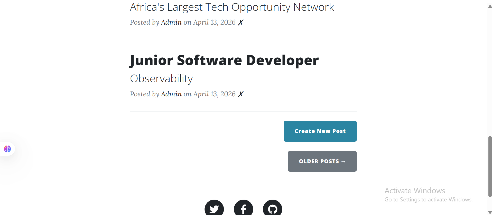
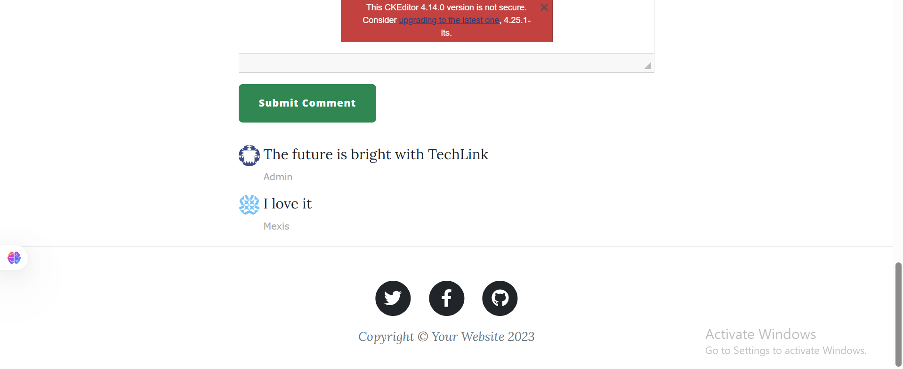

# Flask Blog Application


A full-stack blog application built with Flask, featuring role-based access control, user authentication, and a live PostgreSQL database. Deployed on Render with Supabase as the production database.

> **Live Demo:** [https://flask-blog-3qw6.onrender.com](https://flask-blog-3qw6.onrender.com) 

---

## Screenshots

> **Homepage**


> **Blog Post View**


> **Admin Dashboard**


> **User Comment Section**


---

## Features

### Admin
- Create and publish new blog posts
- Delete existing blog posts
- Full control over content management

### Users
- Browse and read all published blog posts
- Register and log in securely
- Comment on posts with name and email displayed

### General
- Role-based access control (admin vs regular user)
- Secure user authentication
- Responsive UI with Jinja2 templating
- Production-ready PostgreSQL database on Supabase

---

## Tech Stack

| Layer | Technology |
|---|---|
| Language | Python 3.12 |
| Framework | Flask |
| Database (local) | SQLite |
| Database (production) | PostgreSQL (Supabase) |
| ORM | Flask-SQLAlchemy |
| Templating | Jinja2 |
| Frontend | HTML, CSS |
| Deployment | Render |
| Server | Gunicorn |

---

## Getting Started

### Prerequisites
- Python 3.10+
- Git

### Installation

```bash
# Clone the repository
git clone https://github.com/BenjaminTutu/flask-blog.git
cd flask-blog

# Create and activate virtual environment
python -m venv venv

# Windows
venv\Scripts\activate

# Mac/Linux
source venv/bin/activate

# Install dependencies
pip install -r requirements.txt
```

### Environment Variables

Create a `.env` file in the root directory:

```
FLASK_KEY=your-secret-key-here
DATABASE_URL=sqlite:///blog.db
```

> For production, replace `DATABASE_URL` with your PostgreSQL connection string.

### Run Locally

```bash
python main.py
```

Visit `http://127.0.0.1:5000`

---

## Deployment

This app is deployed on **Render** with **Supabase PostgreSQL** as the production database.

### Environment Variables on Render

| Key | Value |
|---|---|
| `FLASK_KEY` | Your secret key |
| `DATABASE_URL` | Your Supabase PostgreSQL connection string |

### Procfile

```
web: gunicorn main:app
```

---

## How It Works

1. **Admin** logs in and can create or delete blog posts
2. **Users** register and log in to comment on posts
3. Comments display the commenter's name  beneath each post
4. All data is persisted in PostgreSQL on Supabase in production

---

## Author

**Benjamin Tutu** — Python Backend Developer, Ghana

- GitHub: [@BenjaminTutu](https://github.com/BenjaminTutu)
- Open to: Part-time backend roles, freelance projects, and collaborations

---

## License

This project is licensed under the MIT License.
